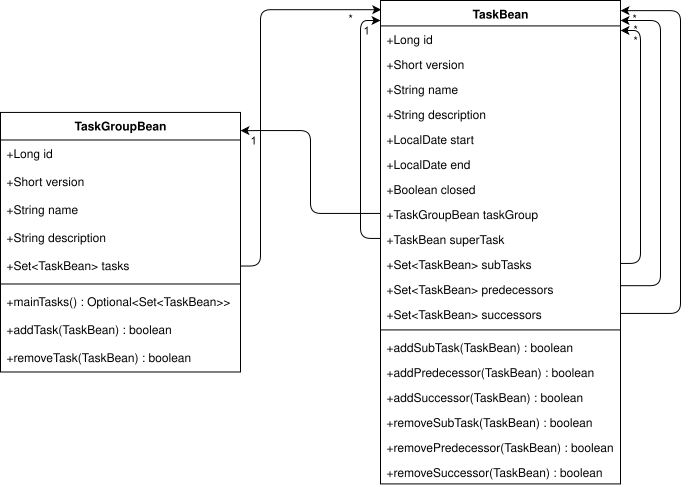
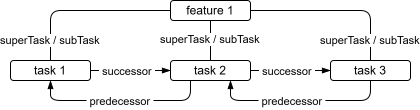

# JPMS in Aktion - das Proof-of-Concept-Projekt pragma

JPMS (Java Platform Module System) ist die Modultechnologie von Java. Sie wurde mit Java 9 eingeführt und ist in pragma ein zentrales Mittel, um die Architektur der Anwendung explizit und prüfbar zu machen.

pragma wurde als Proof of Concept gestartet, um zu prüfen, ob sich JPMS auch in einer nicht trivialen Enterprise-Java-Anwendung sinnvoll einsetzen lässt. Dabei geht es nicht um Dogma, sondern um die praktische Frage, wo Modularisierung echten Mehrwert liefert und wo eine klassischere Struktur angemessener ist.

<p align="center">
  
  <br/>
  <em>Abb. 1: TaskGroup und Task</em>
</p>

<p align="center">
  
  <br/>
  <em>Abb. 2: Task-Objekte</em>
</p>

## Technologiestack

pragma ist eine Client-Server-Java-Anwendung. Aktuell kommen folgende Technologien zum Einsatz:

- Java 25
- Jakarta EE 10 / MicroProfile 6.1
- Open Liberty
- JavaFX 25
- Maven
- Jackson
- Hibernate
- PostgreSQL
- Keycloak
- Docker Compose

Das Backend läuft auf **Open Liberty**. Das Frontend kommuniziert über REST mit dem Backend und spricht für die Authentifizierung direkt mit **Keycloak**. Die Datenhaltung erfolgt in **PostgreSQL**; der Zugriff im Backend ist durchgängig mit JPA umgesetzt.

## Modulstruktur

```text
pragma/
├── core/                         # gemeinsames Domänenmodell und Basistypen
├── bean/                         # fluente Bean-Implementierungen
├── backend/
│   ├── dto/                      # DTOs für den Datentransfer
│   ├── jpa/                      # JPA-Entities
│   └── rest/                     # JAX-RS-WAR, bewusst ohne JPMS
└── frontend/
    ├── rest-client/              # REST-Client und Hilfsbefehle
    └── fx/                       # JavaFX-Oberfläche
```

Bis auf `r-uu.app.pragma.backend.rest` sind die Code-Module mit JPMS modularisiert. `backend.rest` bleibt bewusst ein WAR, weil **Open Liberty** es klassisch auf dem classpath deployt.

## Architektur

Die Architektur ist in wenige, klar getrennte Module aufgeteilt:

| Modul | Aufgabe |
|---|---|
| `core` | Domäneninterfaces, Basistypen und gemeinsame Verträge |
| `bean` | fluente, frameworkfreie Implementierungen der Domäneninterfaces |
| `backend.dto` | REST-DTOs |
| `backend.jpa` | JPA-Entities |
| `backend.rest` | JAX-RS-Ressourcen, Security und Application-Bootstrap |
| `frontend.rest-client` | REST-Client, Authentifizierung und Hilfsbefehle |
| `frontend.fx` | JavaFX-UI und dialogorientierte Oberflächenlogik |

Die zentralen Domänenobjekte sind `Task` und `TaskGroup`. Sie existieren in mehreren Schichten als schichtspezifische Implementierungen desselben Modellvertrags: Bean, JPA, DTO und JavaFX.

## Was JPMS hier bringt

- **Klare Grenzen:** Nur explizit exportierte Packages sind von außen sichtbar.
- **Frühe Fehlererkennung:** Fehlende Abhängigkeiten oder verbotene Zugriffe fallen zur Compile-Zeit auf.
- **Keine Split Packages:** Ein Package gehört eindeutig zu genau einem Modul.
- **Gezielte Reflection:** Frameworks bekommen nur die Packages, die sie wirklich brauchen.
- **Bessere Wartbarkeit:** Die `module-info.java` Dateien dokumentieren die Architektur direkt im Code.

## Aktueller Stand

| Kennzahl | Wert |
|---|---|
| JPMS-Module | 6 |
| Exportierte Packages | 14 |
| `opens`-Direktiven | 12 |
| Qualifizierte `opens` | 0 |
| Öffentliche Typen im modularisierten Teil | 104 |
| Davon intern verborgen | 7 |

Die meisten `opens`-Direktiven sind unqualifiziert, weil die betroffenen Packages nur für Laufzeit-Frameworks wie CDI, FXML oder Jackson geöffnet werden müssen. Eine qualifizierte Freigabe ist im aktuellen Stand nicht nötig.

## Pragmatische Ausnahme: `backend.rest`

`backend.rest` ist bewusst nicht als JPMS-Modul ausgeführt. Der Grund ist nicht fehlende Modularisierungsfähigkeit, sondern die Deploy-Zielplattform: Das WAR wird von **Open Liberty** klassisch betrieben, und der zusätzliche JPMS-Aufwand würde hier keinen praktischen Nutzen bringen.

## Fazit

pragma nutzt **JPMS** dort, wo es Struktur schafft, und verzichtet dort darauf, wo es nur Komplexität hinzufügen würde. Genau diese Balance macht die Modularisierung in diesem Projekt nützlich: klare Schnittstellen, weniger unbeabsichtigte Abhängigkeiten und ein Architekturmodell, das sich direkt am Code ablesen lässt.
