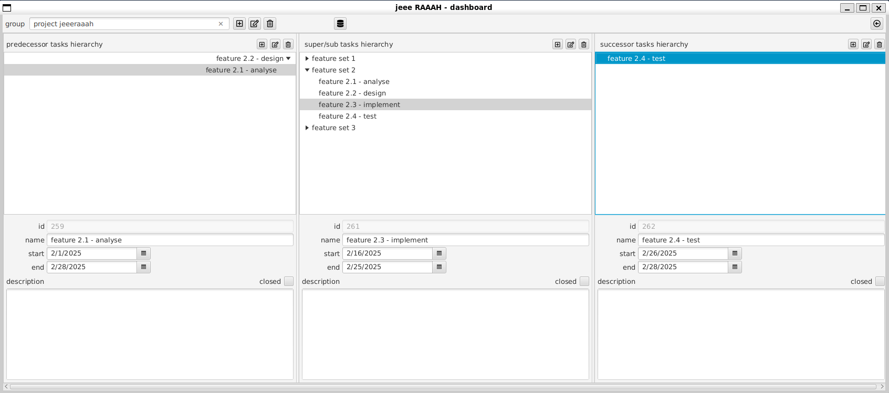
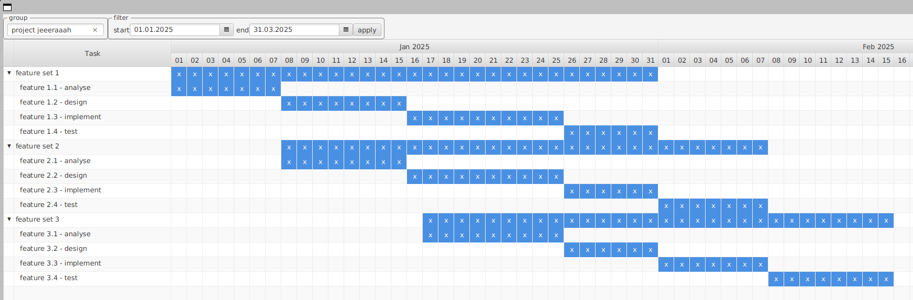

# JPMS in Aktion - das Proof-of-Concept-Projekt pragma

JPMS (Java Platform Module System) ist die Modultechnologie von Java. Sie wurde mit Java 9 eingeführt und ist in pragma ein zentrales Mittel, um die Architektur der Anwendung explizit und prüfbar zu machen.

Für das JDK selbst wird **JPMS** meist als großer Erfolg gewertet, da es seit dem nicht mehr als ein einziger riesiger Monolith (rt.jar) ausgeliefert werden muss, der schon aufgrund seiner Größe nicht mehr zum sich immer weiter verbreitenden Architekturmodell Microservices passte.

In der Java User Community hingegen kämpft JPMS aus verschiedenen Gründen weiter um Akzeptanz:

- Der oft nicht zu vermeidende Einsatz von (noch) nicht modularem legacy code erschwert den Einsatz von JPMS (Stichwort "split packages"). Der Nutzen ist dann ohnehin eingeschränkt: nicht modularer code "landet" in "automatic modules", die zwar auch Module heißen, aber nicht die Vorteile von JPMS Modulen mit sich bringen (dazu später mehr).
- Probleme mit reflection, die mit JPMS gesondert behandelt werden muss.
- Für die effektive Nutzung der JPMS features muss auch eine gewisse Lernkurve in Kauf genommen werden.

Dabei ist Modularisierung ein entscheidender Faktor für die Entwicklung von gut wartbaren, gut verständlichen und gut erweiterbaren, großen Softwaresystemen (siehe den Beitrag [modular software in java](../modular-software-in-java/modular-software-in-java.md)).

pragma wurde als Proof of Concept gestartet, um zu prüfen, ob sich JPMS auch in einer nicht trivialen Enterprise-Java-Anwendung sinnvoll einsetzen lässt. Dabei geht es nicht um Dogma, sondern um die praktische Frage, wo Modularisierung echten Mehrwert liefert und wo eine klassischere Struktur angemessener ist.

Gleichzeitig soll kritisch geprüft werden, ob die Vorteile von Modularisierung mit JPMS die Nachteile überwiegen, z. B. die Komplexität der Modularisierung selbst, die Komplexität der Build- und Deployment-Prozesse, ... .

Fachlich geht es im Projekt pragma im Kern um die Verwaltung von Aufgaben (`Task`s) und die Planung von Arbeitsabläufen. Dazu sollen zusammengehörige `Task`s in Gruppen (`TaskGroup`s) organisiert werden. **Abb. 1** zeigt das zentrale Objektmodell:

<p align="center">
  
  <br/>
  <em>Abb. 1: TaskGroup und Task</em>
</p>

Die Idee ist, Aufgaben in Teilaufgaben zu gliedern (Tasks und SubTasks) und für alle Aufgaben Abläufe (Predecessor- und Successor-Tasks) planen zu können.

<p align="center">
  
  <br/>
  <em>Abb. 2: Task-Objekte</em>
</p>

In der Anwendung sieht das dann im dashboard etwa so aus:

<p align="center">
  
  <br/>
  <em>Abb. 3: pragma dashboard</em>
</p>

Eine Gantt-Diagramm-Darstellung zeigt eine andere Sicht auf Aufgaben und die geplanten Abläufe:

<p align="center">
  
  <br/>
  <em>Abb. 4: pragma Gantt Diagramm</em>
</p>

## Technologiestack

> Ein Ziel des POCs ist, die Versionen der eingesetzten Technologien dauerhaft auf einem möglichst modernen Stand zu halten. Updates aller Technologien gehören daher zur Tagesordnung.

pragma ist eine client-server Java Anwendung, deren Bestandteile mit Java 25 und JPMS (bis auf eine Ausnahme, dazu später mehr) entwickelt wurden. Dabei kommen aktuell folgende Technologien zum Einsatz:

Das Backend ist eine Jakarta EE 10 / Microprofile 7.0 Anwendung. Als Application Server wird Open Liberty verwendet. Im Frontend kommt JavaFX 25 zum Einsatz.

Frontend und Backend sind (weitestgehend) mit JPMS modularisiert. Die Kommunikation zwischen ihnen erfolgt über REST APIs, die mit Jakarta-RS implementiert wurden. Die (De-) Serialisierung der Daten erfolgt mit **Jackson**, was einen komfortablen und gleichzeitig effizienten Umgang auch mit zirkulären Datenstrukturen (siehe `Task`/`TaskGroup` Objektmodell) erlaubt. Build Prozesse für beide Anwendungen werden mit Apache Maven realisiert.

Für das Identity and Access Management (IAM) wird Keycloak verwendet. Das frontend kommuniziert direkt mit Keycloak, um die Authentifizierung der Benutzer durchführen zu lassen. Das Open Liberty backend ist so konfiguriert, dass es die von Keycloak ausgestellten Token akzeptiert und die Autorisierung für alle eingehenden Requests durchführen kann.

Die persistente Datenhaltung im Backend wird mit einer Postgres Datenbank realisiert. Sie wird genau wie Keycloak in einem von `docker-compose` orchestrierten Container betrieben. In diesem POC liegen die pragma- zusammen mit den keycloakk-Daten in ein und derselben Datenbank, sie sind aber jeweils explizit einem eigenen Schema zugeordnet. Die pragma Zugriffe auf die Datenbank sind durchgängig mit JPA (hibernate) umgesetzt.

- Java 25
- Jakarta EE 10 / MicroProfile 7.0
- Open Liberty
- JavaFX 25
- Maven
- Jackson
- Hibernate
- PostgreSQL
- Keycloak
- Docker Compose

Das Backend läuft auf Open Liberty. Das Frontend kommuniziert über REST mit dem Backend und spricht für die Authentifizierung direkt mit Keycloak. Die Datenhaltung erfolgt in PostgreSQL; der Zugriff im Backend ist durchgängig mit JPA umgesetzt.

## Modulstruktur

```text
pragma/
├── core/                         # gemeinsames Domänenmodell und Basistypen
├── bean/                         # fluente Bean-Implementierungen
├── backend/
│   ├── dto/                      # DTOs für den Datentransfer
│   ├── jpa/                      # JPA-Entities
│   └── rest/                     # JAX-RS-WAR, bewusst ohne JPMS
└── frontend/
    ├── rest-client/              # REST-Client und Hilfsbefehle
    └── fx/                       # JavaFX-Oberfläche
```

Bis auf `r-uu.app.pragma.backend.rest` sind die Code-Module mit JPMS modularisiert. `backend.rest` bleibt bewusst ein WAR, weil Open Liberty es klassisch auf dem classpath deployt.

## Architektur

Die Architektur ist in wenige, klar getrennte Module aufgeteilt:

| Modul | Aufgabe |
|---|---|
| `core` | Domäneninterfaces, Basistypen und gemeinsame Verträge |
| `bean` | fluente, frameworkfreie Implementierungen der Domäneninterfaces |
| `backend.dto` | REST-DTOs |
| `backend.jpa` | JPA-Entities |
| `backend.rest` | JAX-RS-Ressourcen, Security und Application-Bootstrap |
| `frontend.rest-client` | REST-Client, Authentifizierung und Hilfsbefehle |
| `frontend.fx` | JavaFX-UI und dialogorientierte Oberflächenlogik |

Die zentralen Domänenobjekte sind `Task` und `TaskGroup`. Sie existieren in mehreren Schichten als schichtspezifische Implementierungen desselben Modellvertrags: Bean, JPA, DTO und JavaFX.

### Module im Detail

#### Modul `core`

Das `core`-Modul enthält die zentralen Domain-Interfaces, Basistypen und gemeinsamen Verträge für das gesamte pragma-System. Es bildet das Fundament, auf dem alle anderen Module aufbauen.

```java
module de.ruu.app.pragma.core
{
    requires transitive de.ruu.lib.jpa.core;
    requires org.jspecify;
    requires com.fasterxml.jackson.annotation;

    exports de.ruu.app.pragma.core;
}
```

Das `requires transitive de.ruu.lib.jpa.core` stellt sicher, dass alle Module, die `core` verwenden, automatisch Zugriff auf die JPA-Core-Typen haben – ohne diese explizit deklarieren zu müssen.

#### Modul `bean`

Das `bean`-Modul enthält frameworkfreie Implementierungen der Domain-Interfaces aus `core`. Die Implementierungen verwenden fluente Accessoren anstelle klassischer Getter/Setter und sind für die Realisierung von Geschäftslogik vorgesehen.

#### Modul `backend.dto`

Das `dto`-Modul enthält die DTO-Klassen (Data Transfer Objects), über die Frontend und Backend kommunizieren. Die DTOs implementieren die generischen Interfaces aus `core` und sind für die (De-)Serialisierung über Jackson optimiert.

```java
module de.ruu.app.pragma.dto
{
    requires de.ruu.app.pragma.core;
    requires org.jspecify;
    requires com.fasterxml.jackson.annotation;
    requires static jakarta.validation;

    exports de.ruu.app.pragma.dto;
    opens   de.ruu.app.pragma.dto to com.fasterxml.jackson.databind; // allow reflective access for JSON serialization
}
```

#### Modul `backend.jpa`

Das `jpa`-Modul enthält die JPA-Entities für die persistente Datenhaltung. Es hängt nur von `core` ab, nicht von `dto` – eine bewusste Entscheidung, um den Persistence Layer vom Transfer Layer zu entkoppeln.

```java
module de.ruu.app.pragma.jpa
{
    requires de.ruu.app.pragma.core;
    requires jakarta.persistence;
    requires jakarta.annotation;
    requires org.jspecify;
    // open exclusively to Hibernate for reflection-based entity mapping
    opens de.ruu.app.pragma.jpa to org.hibernate.orm.core;

    exports de.ruu.app.pragma.jpa;
}
```

#### Modul `frontend.rest-client`

Das `rest-client`-Modul enthält den REST-Client für die Kommunikation mit dem Backend sowie Hilfsbefehle für Datenbankoperationen. Durch JPMS ist die öffentliche API klar auf zwei Packages beschränkt: das eigentliche Client-API und Datenbankbefehle (`dbcommand`).

#### Modul `frontend.fx`

Das `fx`-Modul enthält die vollständige JavaFX-Oberfläche. Es exportiert gezielte UI-Packages und öffnet Packages für CDI- und FXML-Reflection. Das Package `fx.task.hierarchy` ist ein Beispiel für ein Package, das nur via `opens` für FXML zugänglich ist, aber **nicht exportiert** wird – es ist zur Compile-Zeit für externe Module unsichtbar.

```java
module de.ruu.app.pragma.fx
{
    // ... (requires-Direktiven) ...

    // no exports: kein anderes Modul importiert aus de.ruu.app.pragma.fx zur Compile-Zeit
    // opens für CDI (Weld), FXML und JavaFX Application-Start (javafx.graphics)
    opens de.ruu.app.pragma.fx                to javafx.graphics, javafx.fxml, weld.se.shaded;
    opens de.ruu.app.pragma.fx.admin          to javafx.fxml, weld.se.shaded;
    opens de.ruu.app.pragma.fx.task.edit      to javafx.fxml, weld.se.shaded;
    opens de.ruu.app.pragma.fx.task.view      to javafx.fxml, weld.se.shaded;
    opens de.ruu.app.pragma.fx.task.hierarchy to javafx.graphics, javafx.fxml, weld.se.shaded;
    opens de.ruu.app.pragma.fx.task.gantt     to javafx.graphics, javafx.fxml, weld.se.shaded;
    opens de.ruu.app.pragma.fx.task.graph     to javafx.graphics, javafx.fxml, weld.se.shaded;
    opens de.ruu.app.pragma.fx.taskgroup.edit to javafx.fxml, weld.se.shaded;
    opens de.ruu.app.pragma.fx.taskgroup.view to javafx.fxml, weld.se.shaded;
}
```

## Konkrete Vorteile von JPMS im Projekt pragma

### Quantitative Kapselungsmetriken

Die pragma-Anwendung besteht aus **6 JPMS-Modulen**, die zusammen **14 Packages exportieren**.

Von insgesamt **104 öffentlichen Typen** (Klassen, Interfaces, Enums, Records) im modularisierten Teil sind:

- **58 Typen (55.8%)** in exportierten Packages → Teil der öffentlichen API
- **46 Typen (44.2%)** in nicht-exportierten Packages → **durch JPMS vor externem Compile-Zeit-Zugriff geschützt**

Davon sind 39 Typen in geöffneten (`opens`-only) Packages zugänglich via Reflection (für CDI und FXML), aber nicht importierbar. Die restlichen 7 Typen sind weder exportiert noch geöffnet – vollständig verborgen.

Das `frontend.fx`-Modul trägt den größten Teil dieser Verbesserung: durch die Umstellung von 8 `exports` auf reine `opens`-Direktiven sind nun 39 UI-Typen (Controller, Services, App-Klassen) vor direktem compile-zeitlichem Zugriff geschützt. Alle opens sind qualifiziert – jedes Framework erhält nur Zugriff auf die Packages, die es wirklich braucht:

```java
// Packages mit Application-Subklassen (brauchen javafx.graphics für Start)
opens de.ruu.app.pragma.fx to javafx.graphics, javafx.fxml, weld.se.shaded;

// Packages mit nur FXML-Controllern und CDI-Beans
opens de.ruu.app.pragma.fx.admin to javafx.fxml, weld.se.shaded;

// JPA-Entities: nur Hibernate darf reflektiv zugreifen
opens de.ruu.app.pragma.jpa to org.hibernate.orm.core;

// DTOs: nur Jackson darf reflektiv zugreifen
opens de.ruu.app.pragma.dto to com.fasterxml.jackson.databind;

// CDI-Beans im REST-Client: nur Weld
opens de.ruu.app.pragma.client to weld.se.shaded;
```

### Klare Schnittstellen durch explizite Package-Exports

Durch JPMS definiert jedes Modul explizit, welche Packages nach außen sichtbar sind. Alle anderen Packages bleiben intern.

**Beispiel: `core` – minimale öffentliche API:**
```java
module de.ruu.app.pragma.core
{
    requires transitive de.ruu.lib.jpa.core;
    requires org.jspecify;
    requires com.fasterxml.jackson.annotation;

    exports de.ruu.app.pragma.core; // einziges öffentliches Package
    // alle anderen Packages des Moduls bleiben verborgen
}
```

**Resultat:** Nur das Package mit den Domain-Interfaces ist öffentlich. Alle internen Hilfsstrukturen bleiben verborgen.

### Explizite Abhängigkeiten

Jedes Modul deklariert seine Abhängigkeiten mit `requires`, was die Abhängigkeitsstruktur transparent macht und zirkuläre Abhängigkeiten zur Compile-Zeit verhindert. Stille, undeklarierte Abhängigkeiten wie im Classpath-Betrieb sind ausgeschlossen – eine Abhängigkeit, die nicht deklariert ist, kann nicht verwendet werden.

### Compile-Time-Validierung

JPMS prüft bereits zur Compile-Zeit, ob alle Abhängigkeiten aufgelöst werden können und ob auf nicht exportierte Packages zugegriffen wird. Das verhindert viele Fehler, die im klassischen Classpath-Betrieb erst zur Laufzeit als `ClassNotFoundException` aufgefallen wären.

**Konkrete Beispiele aus dem Projekt:**
- Versuch, ein nicht exportiertes Package direkt zu importieren, schlägt zur Compile-Zeit fehl
- Fehlende `requires`-Direktive wird sofort erkannt
- Zirkuläre Abhängigkeiten zwischen Modulen sind strukturell ausgeschlossen

### Gezielte Reflection-Zugriffe

Mit `opens` können gezielt nur bestimmte Packages für Laufzeit-Frameworks geöffnet werden, anstatt alles über den Classpath zugänglich zu machen.

**Beispiel aus `backend.jpa`:**
```java
// Öffnet JPA-Entities ausschließlich für Hibernate-Reflection
// (kein compile-time Import von außen möglich – nur Reflection-Zugriff durch Hibernate)
opens de.ruu.app.pragma.jpa to org.hibernate.orm.core;
```

**Wichtige Unterscheidung:**
- `exports` → compile-time API: andere Module können `import` verwenden
- `opens` (ohne `exports`) → Laufzeit-Reflection: Frameworks können via Reflection zugreifen, aber kein `import`

Das Package `fx.task.hierarchy` im `frontend.fx`-Modul ist ein konkretes Beispiel: Es ist geöffnet (`opens`) für FXML-Injection, aber nicht exportiert – externe Module können die enthaltenen Klassen nicht importieren.

> **Aktueller Stand:** Alle 13 `opens`-Direktiven in pragma sind qualifiziert. Jedes Framework erhält nur Zugriff auf die Packages, die es wirklich braucht: Hibernate auf JPA-Entities, Jackson auf DTOs, Weld auf CDI-Beans, FXML auf Controller-Packages.

### Vermeidung von Split Packages

JPMS erzwingt, dass ein Package nur in einem Modul existieren kann. Dies verhindert das "Split Package Problem", bei dem verschiedene JARs Klassen im gleichen Package liefern und so zu Klassenkonflikten führen.

**Resultat für pragma:** Über alle 6 JPMS-Module und 14 exportierte Packages gibt es **null Split-Package-Konflikte**.

### Dokumentation durch Code

Die `module-info.java`-Dateien dienen als selbstdokumentierende Architekturübersicht – ohne separate Dokumentation ist sofort ablesbar:
- Welche Module hängen wovon ab? → `requires`
- Was ist die öffentliche API? → `exports`
- Welche Frameworks brauchen Reflection? → `opens`

Ein neuer Entwickler kann durch Lesen der `module-info`-Dateien die gesamte Modulstruktur des Projekts verstehen.

### Mehrschichtige Architektur erzwingen

JPMS macht es strukturell unmöglich, gegen die Schichtentrennung zu verstoßen. Im pragma-Projekt gilt:
- `frontend.fx` kann keine JPA-Implementierungsdetails verwenden, die nicht exportiert sind
- `backend.jpa` kann nicht auf Frontend-UI-Code zugreifen
- Die Kommunikation zwischen Frontend und Backend erfolgt ausschließlich über `dto` und `rest-client`

Dies wird zur **Compile-Zeit** erzwungen – nicht erst durch Code-Reviews oder Tests.

### Verbesserte IDE-Unterstützung

IntelliJ IDEA nutzt die JPMS-Deklarationen für:
- Präzisere Code-Vervollständigung (nur exportierte Packages werden vorgeschlagen)
- Frühere Fehlererkennung (Zugriff auf nicht-exportierte Packages wird sofort markiert)
- Bessere Refactoring-Sicherheit (Modulgrenzen werden respektiert)

### Reduzierte Runtime durch jlink

Durch die Modularisierung können mit `jlink` Custom Runtime Images erstellt werden, die nur die tatsächlich benötigten JDK-Module enthalten.

**Im pragma frontend:**
- JavaFX-Anwendung mit JDK 25 Custom Runtime (via jlink): ca. 80 MB
- Vollständiges JDK 25: ca. 320 MB
- **Einsparung: ~75%** der Runtime-Größe

### Zusammenfassung der Vorteile

Die wichtigsten Vorteile von JPMS für pragma auf einen Blick:

1. 🛡️ **Kapselung (44.2%)** – 46 von 104 Typen sind für externe Module zur Compile-Zeit unsichtbar
2. 📊 **Transparente Abhängigkeiten** – der gesamte Dependency-Graph ist explizit in `module-info.java` ablesbar
3. ⚡ **Frühe Fehlererkennung** – Fehler werden zur Compile-Zeit erkannt, nicht zur Laufzeit
4. 📝 **Selbstdokumentierend** – `module-info.java` zeigt die Architektur direkt im Code
5. 🎯 **Erzwungene Schichtentrennung** – technisch sichergestellt, nicht nur Konvention
6. 🔒 **Minimale Reflection-Angriffsfläche** – 13 qualifizierte `opens`, jedes Framework nur wo nötig
7. 🚀 **jlink-fähig** – Custom Runtime Images mit ~75% kleinerer Größe gegenüber dem vollen JDK

## Aktueller Stand

| Kennzahl | Wert |
|---|---|
| JPMS-Module | 6 |
| Exportierte Packages | 6 |
| `opens`-Direktiven | 13 |
| Davon qualifiziert | 13 (100%) |
| Öffentliche Typen im modularisierten Teil | 104 |
| Davon intern verborgen (nicht exportiert) | 46 (44.2%) |
| Split-Package-Konflikte | 0 |

Alle `opens`-Direktiven sind qualifiziert: jedes Framework erhält nur Zugriff auf die Packages, die es wirklich braucht. Das `frontend.fx`-Modul hat keine Exports mehr – die 39 UI-Typen (Controller, Services, App-Klassen) sind ausschließlich über `opens` für Laufzeit-Frameworks zugänglich, nicht aber als compile-zeitliche API.

## Pragmatische Ausnahme: `backend.rest`

`backend.rest` ist bewusst nicht als JPMS-Modul ausgeführt. Der Grund liegt in der WAR-Deployment-Architektur: **Open Liberty** deployt WARs klassisch auf dem `classpath`. Da die Jakarta EE Server APIs selbst nicht vollständig JPMS-konform sind, würden die JPMS-Kapselungsmechanismen in diesem Kontext nicht greifen. Der zusätzliche Konfigurationsaufwand für JPMS wäre hier also ohne nennenswerten Nutzen.

**Diese pragmatische Entscheidung zeigt:** JPMS wird dort eingesetzt, wo es echten Mehrwert bringt – nicht dogmatisch überall.

## Fazit

pragma nutzt JPMS, wo es Struktur schafft, und verzichtet darauf, wo es nur Komplexität hinzufügen würde. Genau diese Balance macht die Modularisierung in diesem Projekt nützlich: klare Schnittstellen, weniger unbeabsichtigte Abhängigkeiten und ein Architekturmodell, das sich direkt am Code ablesen lässt.
